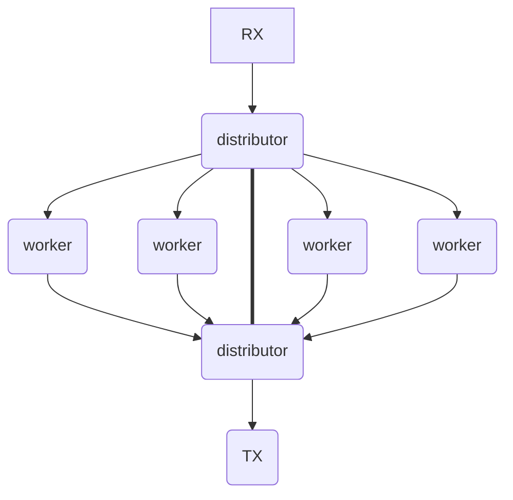
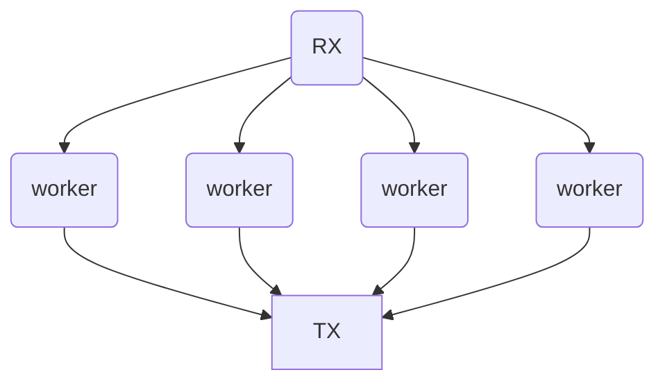
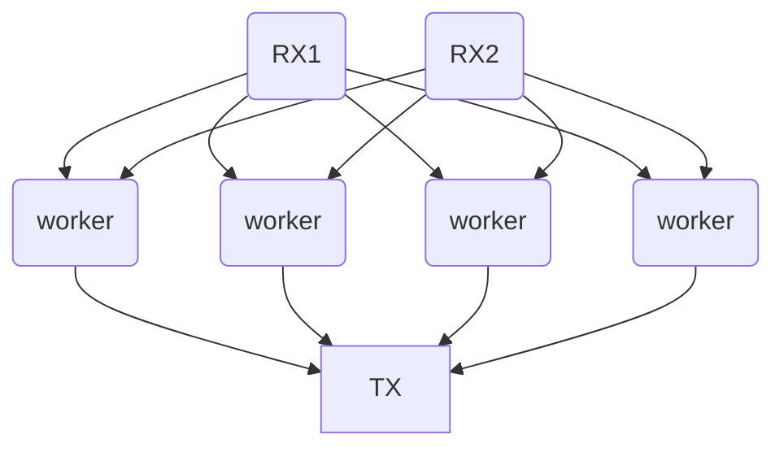

# 实验四 利用DPDK加速DNS查询(Part 2)  

#### 小组成员及贡献

* 邓龙			40%
* 郭金涛		30%
* 王海涵		30%

## 实验思路

### Run To Completion

事实上就是多个处理器运行相同的代码，利用网卡的多队列特性，从网卡获取不同的包。

相当于同时运行多个单线程程序。

### Pipeline

将处理过程的不同部分分配给不同的核，每个核只负责一小部分处理。

相当于把单线程程序不同部分拆开至不同核处理。

## 实验过程及结果

### 版本一：Distributor

首先，我们按照`example/distributor`的示例，模仿实现了结构相同的程序。结构如下：




调整好参数后，性能达到19000/20000包左右。

### 版本二：Multiple Producers/Consumers Ring

事实上，`rte_ring`结构是支持多生产者或多消费者的。这样我们可以省略`distributor`的工作，使`worker`直接从`rx_ring`中获得需要处理的包。再把包直接发送到`tx_ring`中。

这样可以去掉`distributor`线程的工作，简化模型。简化后的模型如下：



修改成如上图结构后，经过测试，程序达到了和Distributor版本相同的发包数量，但是节约了一个核。

### 版本三：Multiple RX/TX

在性能达到19000/20000包后，我们发现性能的瓶颈在于RX。即RX线程仅仅收到了20000个包中的19000个左右，而后面的处理过程中均没有丢包。

于是我们尝试了增加进行RX的线程数，希望能继续提升性能。

为了支持多个RX核，我们开启了网卡的多队列功能。不同RX核直接从网卡的不同队列中获取数据（类似Run To Complete模型）。结构如下：



类似的，我们也实现了多个TX的结构。

经过实验，这个版本并没有增加性能，说明CPU并不是限制RX收包数量的原因。

运行`example/distributor`进行对比，`example/distributor`程序RX效率原高于我们的程序，于是对比两者的参数，发现`NUM_MBUFS`数目不同，修改该参数后，能够处理20000/20000个包。

### 版本四：Wait and Retry

提高发包数量后进行实验，一次性发送100k个包，性能达到80k/100k。此时根据定时输出的统计，性能瓶颈出现在TX线程上。

开启`_DEBUG`宏输出中间信息，有两个发现：

	1. 开启中间信息输出时，TX线程反而能发出更多的包。
 	2. `rte_eth_tx_burst`函数返回的发送成功包数经常为0。

我们尝试了把distributor的TX移植到我们的程序。没有效果。

重新进行distributor的实验，发现当distributor的worker数量增加时，distributor也出现丢包。

具体现象是，worker数量较大时，distributor效率不足，RX由于队列满丢包。worker数量较小时，TX丢包。

分别用不同核数配置运行`distributor`获得的测试结果（`pktgen`均发送100000个包）。以下是8核的情况。

```bash
$ sudo ./build/distributor_app -l 0-15 -- -p 1
RX Thread:
Port 0 Pktsin : 100000
 - Received:    100000
 - Returned:    0
 - Enqueued:    100000
 - Dropped:     0
Distributor thread:
 - In:          100000
 - Returned:    99923
 - Sent:        99923
 - Dropped      0
TX thread:
 - Dequeued:    99923
Port 0 Pktsout: 99023
 - Transmitted: 99923
 - Dropped:     900
Worker 00 Pkts:  0.01. Bursts(1-8): 101 6 2 5 5 10 99 929 
Worker 01 Pkts:  0.01. Bursts(1-8): 105 4 2 5 2 7 90 944 
Worker 02 Pkts:  0.01. Bursts(1-8): 96 5 2 2 2 7 92 941 
Worker 03 Pkts:  0.01. Bursts(1-8): 91 4 2 8 2 7 96 932 
Worker 04 Pkts:  0.01. Bursts(1-8): 99 6 2 1 4 8 99 933 
Worker 05 Pkts:  0.01. Bursts(1-8): 87 4 5 4 4 6 99 925 
Worker 06 Pkts:  0.01. Bursts(1-8): 76 2 2 4 2 6 104 930 
Worker 07 Pkts:  0.01. Bursts(1-8): 115 5 4 3 2 13 91 931 
Worker 08 Pkts:  0.01. Bursts(1-8): 104 3 2 3 4 6 89 940 
Worker 09 Pkts:  0.01. Bursts(1-8): 91 4 1 10 2 12 94 929 
Worker 10 Pkts:  0.01. Bursts(1-8): 133 3 2 5 1 11 96 932 
Worker 11 Pkts:  0.01. Bursts(1-8): 100 2 1 6 1 6 91 943 
```

更多数据参考`data`目录。

但是对比现象不太一致。比较参数，怀疑是`BURST_SIZE_WORKER`参数设为16的问题。

将其设为8后实验，瓶颈又回到WORKER上。调大WORKER数量至16，worker和tx都有drop的情况，TX的drop仍然没有改善。相比于`distributor`20核的情况，显然不太一样。

考虑到distributor可能拖慢了分发速度，导致网卡有机会以更慢速度发送包。（因为8核和16核下，distributor程序的TX出现丢包，而4核、20核却都没有这种情况。核少不丢包是因为没有太多worker并发的给TX压力，核多不丢包是因为`distributor`效率降低，将速率拉至TX能接受的范围内。）暂时假定正是因为网卡来不及发包导致的drop现象。这也解释了加入debug后为什么丢包率反而降低。（每次丢包就会打印一条输出，消耗了一点CPU时间，反而让网卡有时间将一些包发送出去，之后十几个循环就都不再丢包）

于是我们直接增加了发送失败后重试的功能。简单的重试后，虽然能跑满100k/100k个包，但是丢包数巨大。（约350k/100k，即发送失败的包数是成功的包数的3.5倍，平均每个包发送4.5次才成功）

为了降低这样的无用发包，使用`rte_pause`强制暂停CPU一小会。使用一次`rte_pause`，丢包数量明显减少。多次使用`rte_pause`减少并不明显。加入暂停时间，强制暂停100μs，效果拔群，大约1000pkts的发送失败就能跑满100k/100k。

直接将测试包数拉至1M，瓶颈回到RX上。大致能处理0.85M/1M个包。继续调大`NUM_MBUFS`至`distributor`中设置的两倍。worker到TX的`ring`上出现丢包，说明瓶颈仍在TX上，且可能TX以达到最高速率。

由于收发包数量已经很大，可以考虑带宽的问题。发现pkten可以用`-P`参数开启混杂模式，即可直接测带宽，一次发送更多的包，使得整个过程需要数十秒完成。测试发现程序发送速度已经达到线速，所以目前的结果已经是物理极限了。

以下是`pktgen`实验结果一部分：


可以看到Mbits数据上，RX/TX均达到了线速10Gbps左右。

## 问题

**1.   给出选择run to completion(或pipeline)模型的理由。**

一般来说pipeline模型效率更高，而本次实验任务又不算复杂，所以我们实现了pipeline模型。

**2.   参考实验三的测试方法，在服务器上测试程序性能，给出具体数据。**

如第二部分所述。达到了物理带宽。